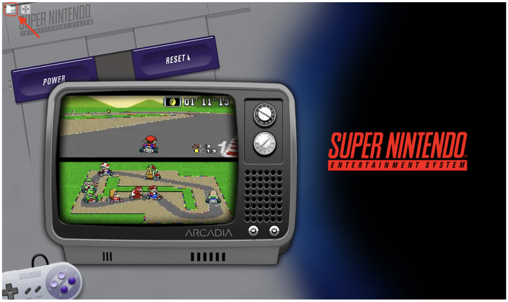
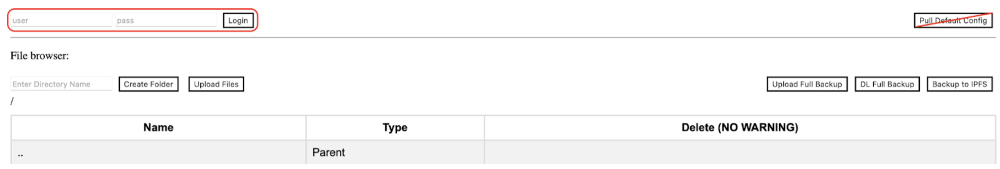
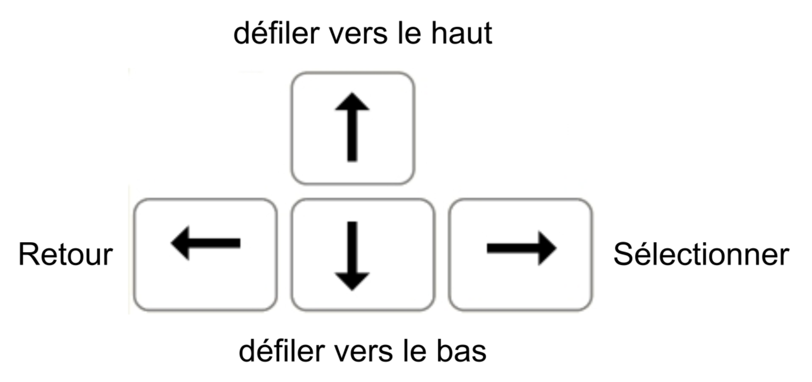
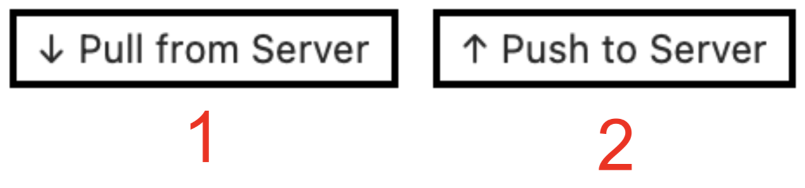
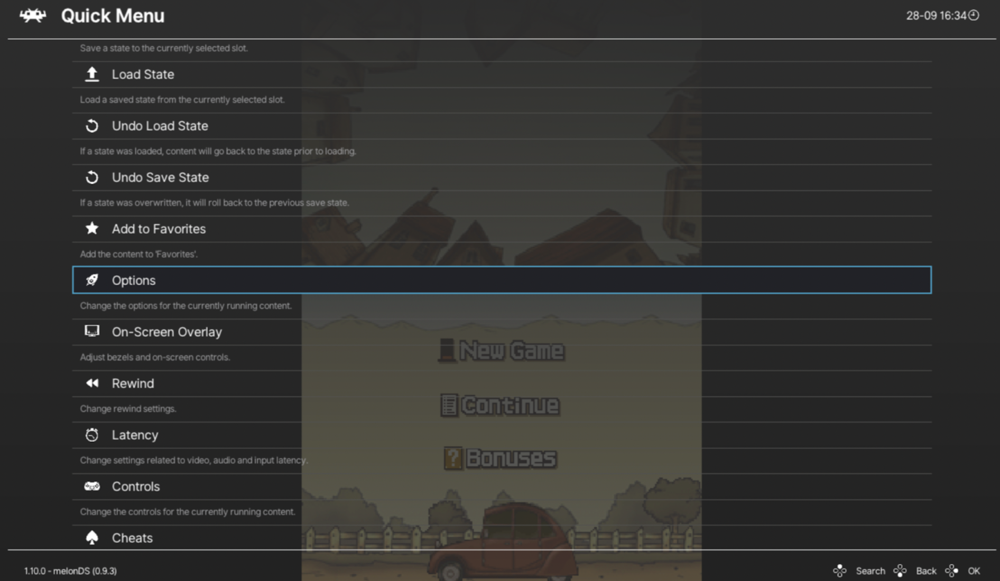

     

# Guide Utilisateur 

## Connection au site 
**Étape 1 :** Se connecter au WIFI du club NPC 

**Étape 2 :** Ouvrir son navigateur WEB préférer et aller sur le site suivant : 
> [emulator.clubnpc.esiee.fr](http://emulator.clubnpc.esiee.fr)

**Étape 3 :** Se connecter à sa session pour sauvegarder sa partie. Pour ça sélectionné l’icône en forme de dossier en haut à gauche de l’écran

Connectez-vous-en remplissant les champs en haut à gauche de la nouvelle page ouverte, puis sélectionner `pull from server` en haut à droite, pour charger vos sauvegardes dans votre session. *(A noté que vous n’êtes pas obligé de vous connecter pour jouer, mais vous ne pourrait pas sauvegarder sur le serveur dans ce cas)*

*(A noté que lorsque vous n’êtes pas connecté, le bouton en haut à droite est `pull Default Config`, il permet de récupérer la configuration par défaut du serveur pour votre session)*

**Étape 4 :** Retourner a la page principale et sélectionnée un émulateur puis un jeu en cliquant sur les noms ou les logos

     <strong>Vous êtes prêt à jouer !</strong>

**Étape 5 :** Une fois votre session de jeux terminée, n’oubliez pas d’enregistrer et d’envoyer votre sauvegarde au serveur dans la page de l'[étape 3](#etape3__), puis en sélectionnant `Push to Server` en haut à droite de la page.

## Navigation
Pour naviguer dans l’émulateur, vous pouvez utiliser les flèche directionnelle ou votre souris.
{ width="500" }

## Contrôle émulateur (par défaut / cheat)
| Touche | Action |
|:------:|:------:|
| espace | Accélération du jeu(continue) |
| L(maintenir) | Accélération du jeu(discontinue) |
| P | Pause/Play |
| K | Pause |
| H | Reset |
| N | Shader |
| **F1** | **Parametre de l'émulateur**[^1] |

[^1]: Attention l’émulateur est en QWERTY il faut donc le prendre en compte lors du maping des touches

## Gestion des sauvegardes
Vous pouvez gérer les documents générés par votre utilisation des émulateurs depuis la page, de l'[étape 3](#etape3__) de même que vos sauvegardes. Accéder au bouton de récupération/envoie de donnée en haut à droite de la page.
{ width="500" }
1. Permet de récupérer les données stockées sur le serveur pour votre compte.
2. Permet d’envoyer au serveur vos données pour qu’elle y soit stockée.

## Paramètres spéciaux

### Activer le tactile sur émulateur DS
**Étape 1 :** Lancer le jeu souhaité, puis faite F1

**Étape 2 :** Naviguer dans le menu à l’aide de la souris ou des flèches directionnelles et descendait jusqu’à trouver le sous menu a sélectionné qui est `option` avec un logo de fusée.

**Étape 3 :** Sélectionné le paramètre `Touch mod`, pour l’activé.

**Étape 4 :** Choisie le contrôle tactile que tu souhaites utiliser.

## Guide utilisateur format PDF 
> [Guide utilisateur EmulatorJS](../documents/emulatorjs/Guide%20utilisateur%20-%20emulatorJS.pdf)