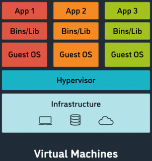

*Prérequis : Hardware et OS*

> On expliquera pas ici comment fonctionne en profondeur un hyperviseur, juste ce que c’est et ce que ça fait / à quoi ça sert, pour plus de précision, google est ton ami.

{ align=right }

Pour faire un simple, quand on veut séparer des processus, on peut soit faire des groups et des users pour chaque processus sur linux notamment, seulement en faisant ça, si l’unique OS tombe pour une raison X ou Y, ou que vous avez besoin de reboot ou que sais-je, c’est chiant.

Donc on a inventé les VM, pour faire simple, faire tourner plusieurs OS séparément sur une même machine, pour se faire on utilise un hyperviseur. 

### Il y’en a 2 grands “types” :  
__Type 1 :__ L’hyperviseur est directement installé sur l’hôte (bare metal), plus optimisé, utile pour les serveurs uniquement (quasiment).  
Les grands noms : 

-   **Proxmox**

    ---

    **KVM *(gratuit, linux based mais un peu plus complexe dés que tu 
veux faire un truc fancy)***

-   **VMware**

    ---

    ESXI *(le grand concurrent  de proxmox, mais payant, et mieux 	
honnêtement)*

-   **Nutanix**

    ---

    AHV *(on l’utilise dans ma boite, c’est puissant mais c’est de la merde)*

-   **Hyper-V**

    ---

    *(Virtualiser sur du Windows, ca marche bien askip mais j’ai  jamais essayé)*

-   **Citrix**

    ---

    Xen *(une solution bien overkill pour faire du BYOD très poussé, 
intéressant mais pas pour nous honnêtement)*

__Type 2 :__ Même chose qu’un type 1, mais host sur un OS complet, moins opti, sert surtout quand t’a besoin d’une linux en TP de C lol.  
Les (2) grands noms :  

* VMware workspace (du vmware mais embarqué sur n’importe quel os)
* VirtualBox (même techno que proxmox, mais dev  par oracle cette fois)
* (Hyper-V fonctionne sur Windows 10/11, mais shhhhh)

Pourquoi virtualiser : 

* __Sécurité :__ Imaginons que tu run une vieille version de MC (genre t’es un FDP de fan de pvp et tu run de la 1.8), avec des failles sympa de type LOG4J GENRE, bah ton serveur c’est ciao, et TOUS tes autres processus se font niquer avec.
* __Simplicité :__ À gérer c’est beaucoup plus simple
* Tu peux reboot une VM sans te poser trop de questions (pose toi en quelques unes quand même)
* Pas de problème de driver blablabla, tu virtualize ton hardware, c’est tjr le meme, donc les devs s’adaptent, et si ils l’ont pas fait, un mec sur un forum l’a surement fait, et si personne l’a fait, demander au Nix, et si EUX ne l’ont pas fait / ne savent pas faire, bah gg.